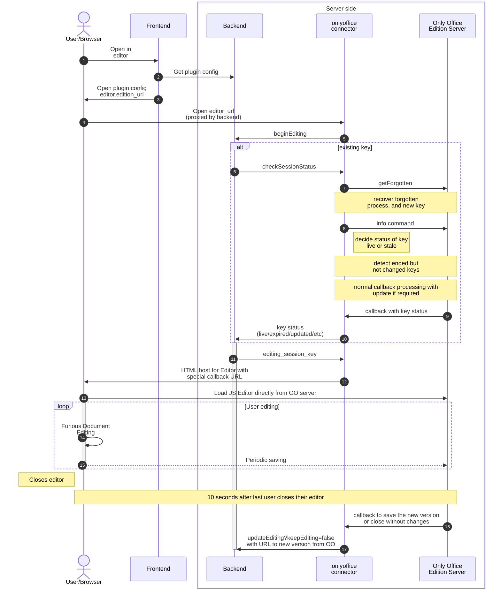
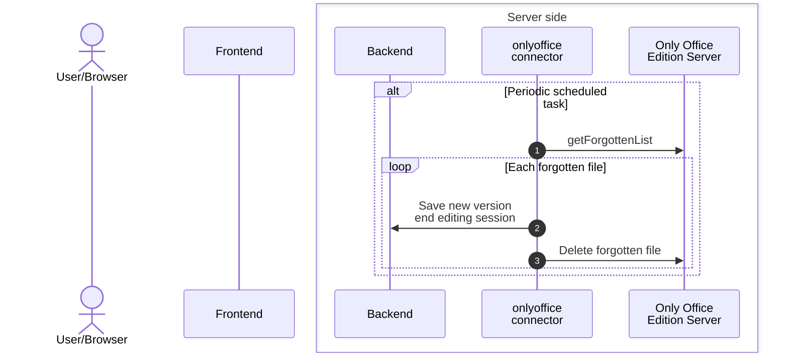

# Twake Drive - How to enable plugins

Plugins, or applications, are configured in the backend's json configuration file `/backend/node/config/{env}.json`:

```json
{
  "applications": {
    "grid": [ ],
    "plugins": [ ]
  }
}
```

The environment variable `APPLICATIONS` can be used to override the configuration file, eg:

```sh
APPLICATIONS='{ "grid": [ ... ], "plugins": [ ... ] }'
```

*Note: the `applications` key is the root of the environment variable's json.*

## Application grid entries

Links in top right drop down application grid can be configured in the `applications.grid` array, eg:

```json
{
  "applications": {
    "grid": [
      {
        "name": "Tmail",
        "logo": "/public/img/grid/tmail.png",
        "url": "https://tmail.linagora.com/"
      }
    ]
  }
}
```

## Plugins

*Currently all applications are automatically active for all companies (subject to change).*

Plugins are defined as entries under the `applications.plugins` array, with at least the following properties:

- `id` is mandatory and must be unique to each plugin. It must be rather short, and alphanumeric with `_`s only.
- `internal_domain` is the internal domain of the plugin's server, it must be the same as the one in the docker-compose.yml file for ex. or resolvable and accessible to the Twake Drive backend server.
- `external_prefix` is the external URL prefix of the plugin exposed by the backend and proxied to the `internal_domain`.
- `api.private_key` is the shared secret used by the plugin's server to authentify to the backend

### Proxying

- The frontend server in development (next), or nginx in production, should relay all requests to `/plugins/*` to the same url on the Twake Drive backend
- The Twake Drive backend will proxy all requests below `external_prefix` to the same url at `internal_domain` intead for the matching plugin

### Application authentification

- To send API commands to Twake Drive, the application must first obtain a JWT token. This is obtained by `POST https://[backend]/api/console/v1/login`, with a JSON body containing the shared `{ id, secret: api.private_key }`, and an `Authorization` header with as Basic auth the base64 encoded pair in the format `id:api.private_key`. See [refreshToken](https://github.com/linagora/twake-drive/blob/main/tdrive/connectors/onlyoffice-connector/src/services/api.service.ts). The response should be in the format `{resource: {access_token: { value }}}`. The resulting token expires and should be periodically renewed.

- To authenticate further API requests, add the returned token to the headers as `Authorization: Bearer $token`.

### User initiated notifications to a plugin

`POST /companies/:company_id/applications/:app_id/event`

Sending a request of this format to the backend will proxy that request after signing it to `plugin.api.hooks_url`. Accepts JSON body with fields `type`, `content` and optionally `name`. Adds the header `X-Tdrive-Signature` containing a hex encoded sha256 of the json body hmac signature with `plugin.api.private_key`, and returns the remote's response to the user.

The payload sent to the hooks server includes: `{ type, name, content, connection_id, user_id, company_id, workspace_id}` (see `ApplicationHooksService.notifyApp`).

## File plugins

The configuration in `plugin.display.tdrive.files` allows a plugin to hook file creation, preview and edition.

Here is (an incomplete) example based of the Only Office connector plugin.

```json
{
  "applications": {
    "plugins": [
      {
        "id": "tdrive_onlyoffice",
        "internal_domain": "http://plugins_onlyoffice:5000/",
        "external_prefix": "/plugins/onlyoffice/",
        "api": { "private_key": "apisecret" },
        "display": {
          "tdrive": {
            "version": 1,
            "files": {
              "editor": {
                "preview_url": "/plugins/onlyoffice/?preview=1",
                "edition_url": "/plugins/onlyoffice/",
                "empty_files": [
                  {
                    "url": "/plugins/onlyoffice/assets/empty.docx",
                    "filename": "Untitled.docx",
                    "name": "ONLYOFFICE Word Document"
                  }
                ],
                "extensions": [ "docx", "odt" ]
              }
            }
          }
        },
        "identity": {
          "code": "only_office",
          "name": "Only Office",
          "icon": "/plugins/onlyoffice/assets/logo.png",
          "description": null,
          "website": "http://twake.app/",
          "categories": [],
          "compatibility": ["tdrive"]
        }
      }
    ]
  }
}
```

### Creation

The field `editor.empty_files` can contain a list of template empty files editable by this plugin. The files must be hosted below the url in `external_prefix` (eg. `"/plugins/onlyoffice/"`). The backend will proxy all requests below `external_prefix` to the same url at `internal_domain` intead.

The file will then be downloaded by the browser from that URL, added to the current folder by Twake Drive, and opened in the provided editor.

### Preview and Editing

When a user requests a preview and then possibly to edit the file, an IFrame is opened and pointed to `files.editor.preview_url` or `files.editor.edition_url`, with the following query parameters:

  - `token`: a JWT that can be used to authenticate as the user when calling the Twake Drive API
  - `workspace_id`, `company_id`: Identifiers of the respective items
  - `file_id`: External file identifier
  - `drive_file_id`: Optional internal (to Twake Drive) file identifier

In the case of the OnlyOffice application, these URLs are pointing to the connector plugin, which then proxies back and forth with the OnlyOffice document server.

#### Editing session key

When editing a file, at first, a new session key is created on the file by the
backend and atomically swapped.

This session key uniquely identifies the user, company, and plugin and it is not encrypted.

An editing session key prevents others from starting, can be updated with new versions, and
ended with and without a new version.

See operations `beginEditing` and `updateEditing` in `tdrive/backend/node/src/services/documents/services/index.ts` for operations available on that key.

Basic flow is:
  - Call `beginEditing`
    - If a key previously was set for that file, uses the `/check` endpoint of the plugin to update the key status first
    - Twake Drive generates an editing session key and returns it (or returns the existing one).
  - Optionally call `updateEditing?keepEditing=true` with a file stream to generate intermediary versions
  - End the session by calling `updateEditing` (without `keepEditing=true`). If a file is provided, a new (and final) FileVersion
    is created with that content. Otherwise, the editing session is cleared without creating a new version.


#### API to expose by the application

Authentication from the Twake Drive backend is a JWT with the property `type` being
`"tdriveToApplication"` and signed with the shared secret. The application must accept
multiple parallel requests for the same key gracefully.

- `POST /tdriveApi/1/session/${editing_session_key}/check`

    Sent by Twake Drive backend when beginning a new editing session or investigating
    stored keys. The application is expected to process the key if possible before responding,
    and provide a response in JSON. The `error` key of that body should be truthy if the response
    is not known. Otherwise it should respond:

  - `{ status: 'unknown' }`: the key isn't known and maybe used for a new session
  - `{ status: 'updated' }`: the key needed updating but is now invalid
  - `{ status: 'expired' }`: the key was already used in a finished session and can't be used again
  - `{ status: 'live' }`:    the key is valid and current and should be used again for the same file (if multiple writers are allowed)

#### Example flow of editing session



#### Batch processing of unknown keys

Periodically, the plugin, and twake drive, should run batch cleanup operations on editing session keys
to ensure they are live, or removed, as they may block other operations until then.

Here is an example initiated by the plugin:



### Example: OnlyOffice plugin

The [OnlyOffice connector plugin](https://github.com/linagora/twake-drive/tree/main/tdrive/connectors/onlyoffice-connector) is an example of plugin. It's readme includes an example configuration for the backend.
